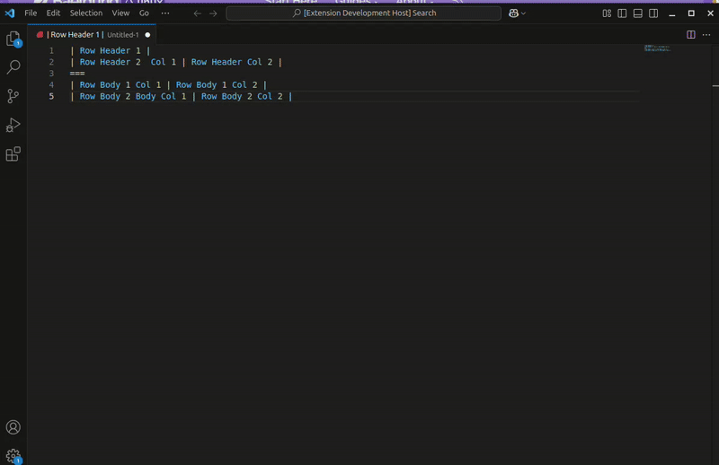
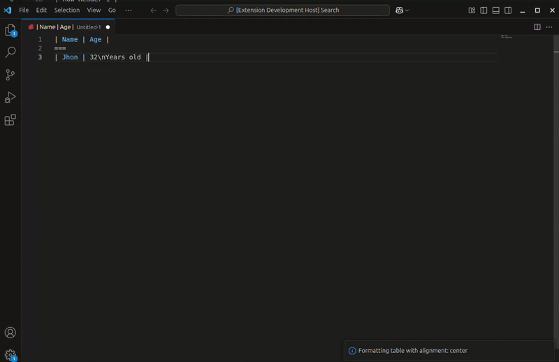

# pandoc-grid-table-formatter README

Simple visual studio code extensions to formato table in grid layout compatible with pandoc.

## Features

Convert md formatted table in grid layout.

## How to use

You can have multiple header row, the first header can be single column.
To separate header from body you have to write : **===**

**EXAMPLE**

**INPUT**

```
| Row Header 1 |
| Row Header 2  Col 1 | Row Header Col 2 |
===
| Row Body 1 Col 1 | Row Body 1 Col 2 |
| Row Body 2 Body Col 1 | Row Body 2 Col 2 |
```

Select the text, right click and select the command Pandoc-table: format ( or use the command palette )
Select the alignment, Left, Right or Center.

**OUTPUT**

```
+-----------------------+------------------+
| Row Header 1                             |
+-----------------------+------------------+
| Row Header 2  Col 1   | Row Header Col 2 |
+:=====================:+:================:+
| Row Body 1 Col 1      | Row Body 1 Col 2 | 
+-----------------------+------------------+
| Row Body 2 Body Col 1 | Row Body 2 Col 2 | 
+-----------------------+------------------+
```



You can have multiple lines inside **body cell**, just write \n where you want to escape.

**EXAMPLE MULTIPLE LINE BODY CELL**

**INPUT**

```
| Name | Age |
===
| Jhon | 32\nYears old |
```

**OUTPUT**

```
+------+-----------+
| Name | Age       |
+:====:+:=========:+
| Jhon | 32        | 
|      | Years old | 
+------+-----------+
```



## Requirements

None

## Extension Settings

## Known Issues

## Release Notes

### 1.0.0

Initial release of pandoc-grid-table-formatter
---